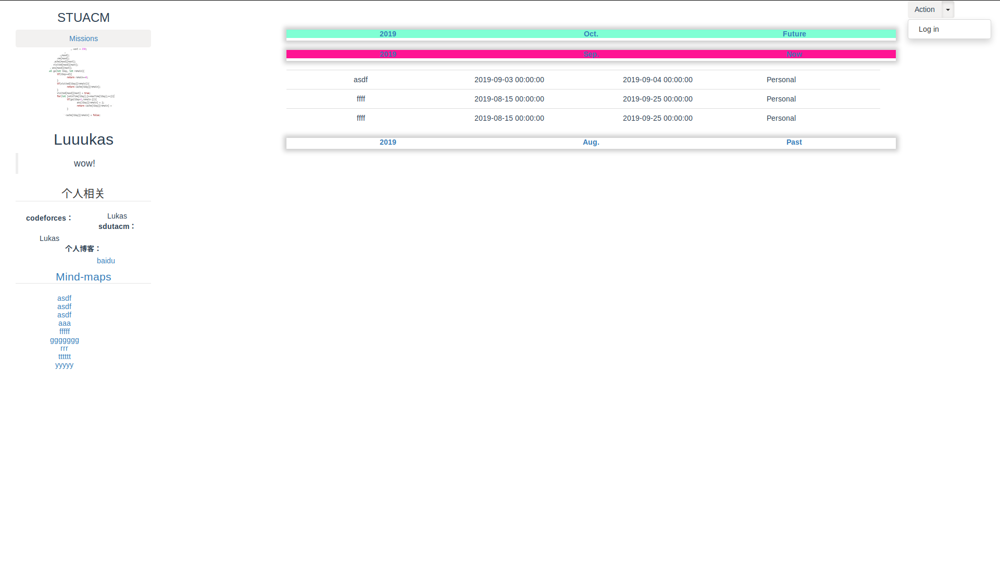
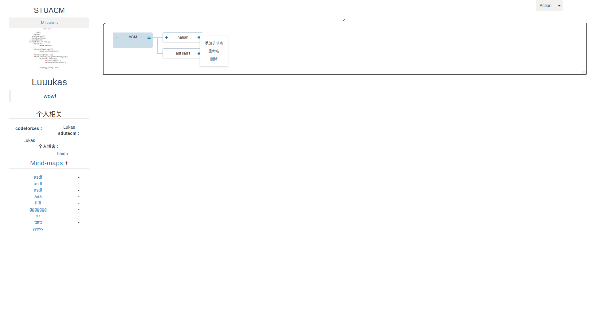
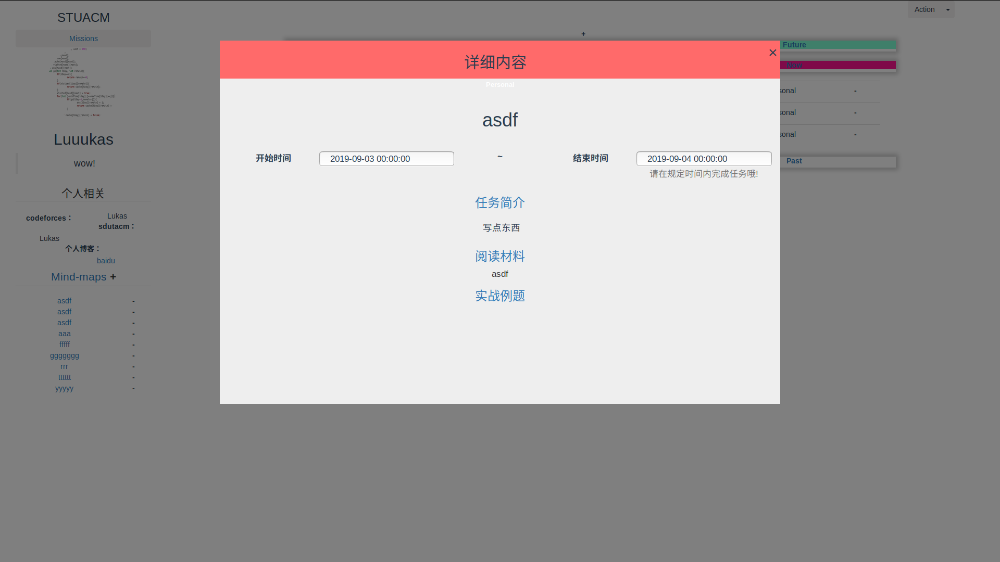
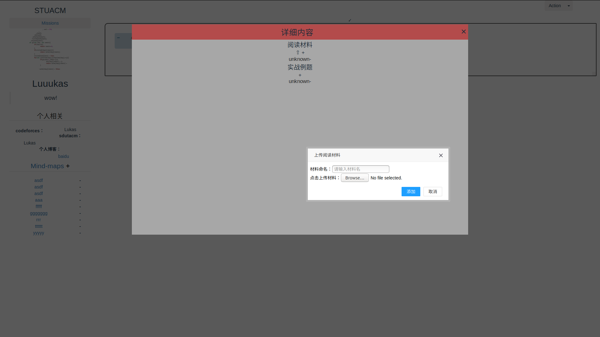
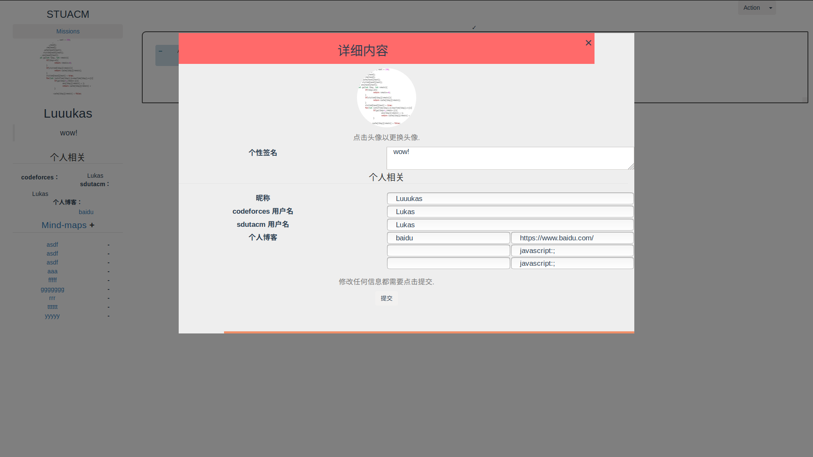

# STUACM

> A Vue.js project

## 技术栈

``` bash
前端Vue.js，用到vuex、vue-resource。
后端Node.js，用到express、formidable、express-session、mysql。
```

## 文件结构
``` bash
**ACM-MISSIONS**
	effect_pictures: 该目录下保存项目效果图
	server: 该目录下为Node.js的服务端文件
	其他文件均由vue-cli生成

**ACM-MISSIONS/src/store**
	index.js: 该文件用vuex实现全局变量的存储
	
**ACM-MISSIONS/src/components**
	Home.vue: 主页，主要用于提供各种文件，网站资源
	Enroll.vue: 注册页面
	MainPage.vue: 主页面
	showProfile.vue: 主页面中左侧展示个人信息的组件
	aMindMap.vue: Mind-maps折叠面板下的一项
	newMindMap.vue: 新建mindmap时，填写表单的弹出框
	MindMap.vue: 点击一项mindmap时，主页面右侧<router-view>将展示该页面，渲染相应导图，并会被填入相应数据
	Detail.vue: 点击导图中的节点时，弹出该弹出框，并会被填入该节点的相应信息
	MissionsPage.vue: 点击左上角Missions button时，主页面右侧<router-view>将展示任务列表
	aSetOfMissions.vue: 任务列表中的一项折叠面板
	aPieceOfMission.vue: 一项折叠面板中的一项任务
	aMission.vue: 点击一项任务后，弹出该弹出框，并会被填入该任务的相应信息
	newMission.vue: 新建Personal mission时，填写表单的弹出框
	EditProfile.vue: 修改个人信息时，填写表单的弹出框
	
**ACM-MISSIONS/server/public**
	files: 该目录保存用户上传的文件
	imgs: 该目录保存用户头像图片
	
**ACM-MISSIONS/server**
	package.json:
	node_modules:
	public:
	file_handle.js: 用formidable专门用于保存用户上传的文件
	img_handle.js: 用formidable专门用于保存用户上传的头像
	sql_handle.js: 用mysql专门处理与数据库交互的事件
	server.js: 服务ACM-MISSIONS的服务器文件
	CODEFORCES_worker.js: codeforces爬虫，输入用户名，爬取其所有提交
	SDUT_worker.js: sdutacm爬虫，输入用户名，爬取其所有提交
```

## 注意事项
``` bash
1. Vue与layui存在莫名冲突，layui的折叠面板在Vue中可能需要手动刷新页面才能正常使用
2. 该项目同时使用了layui和boostrap两个ui库，使用时需要格外注意避免两个ui库之间的冲突
3. Vue与Node运行在不同端口上，需要注意跨域问题
4. 项目中的请求路径，数据库信息，express-session的密钥secret需要按环境修改
5. 注意异步问题，尤其是数据库操作和爬虫
```

## 功能描述

``` bash
* 展示，修改个人信息
* 登录、注册、修改密码
* 添加、查看任务
* 添加、编辑、查看思维导图
* 后台定时爬虫更新每个用户每个任务的状态
```
## TODO
``` bash
前端:
	1. 完善css
	2. 主页资源站
后端：
	1. Official为所有人添加题目
	2. 注册激活码数据库
	3. 爬虫刷新状态
	4. 数据库取email邮件通知
	5. 爬虫改为并发
```
## 当前效果图









